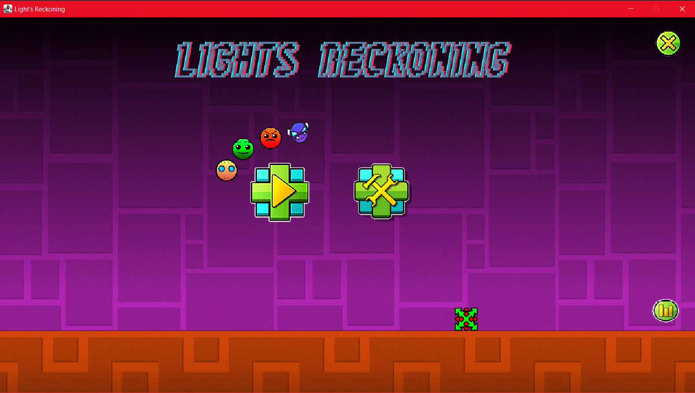
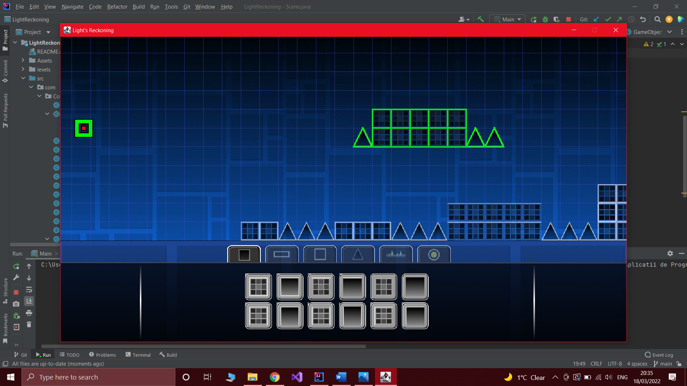
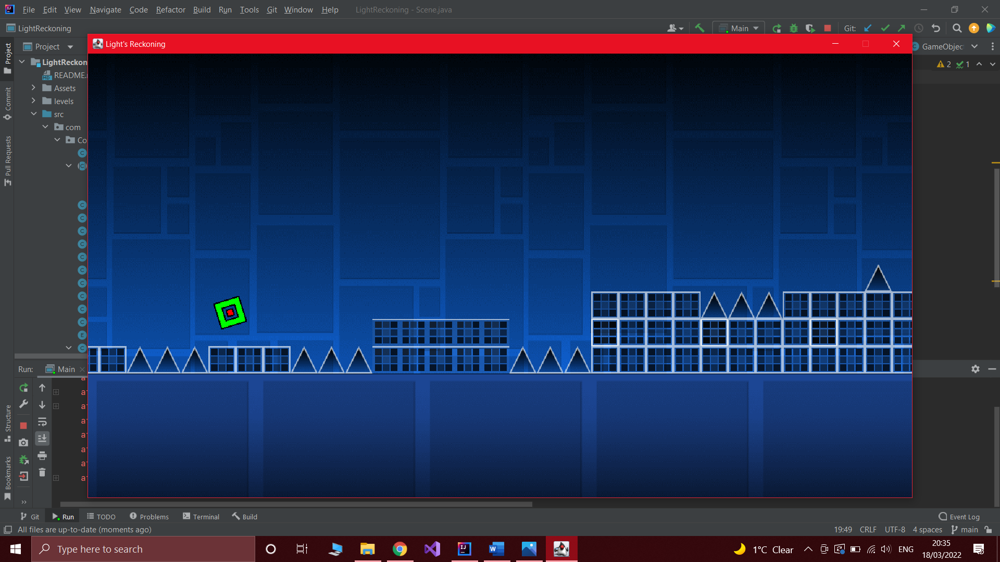

# Light's Recokoning

## Description

This is a Java-based game inspired by Geometry Dash, featuring simplified mechanics and design. Players navigate through levels representing Dosalfar's journey and the evolution of the spirits of light in their quest to return home.

## Gameplay

The game consists of traversing levels that symbolize Dosalfar's journey home. In Stereo Madness, Dosalfar must overcome initial challenges to progress on his path. Subsequent levels like Deadlocked and Eternal Cycles present increasingly difficult obstacles, testing Dosalfar's resolve. The final level, Fingerdash, presents the ultimate challenges before Dosalfar can return home.

## Rules

Players must rely on their own insight and reflexes to navigate obstacles and complete levels without dying. Apart from staying calm and enjoying the game, there are no other rules!

## Controls

In Editor Mode:

- Save Button – Save level
- Play Button – Load & Play Created Level
- Ctrl + D – Duplicate selected blocks
- Scroll Mouse Button - Move camera
- Arrow Keys – Move selected objects
- Shift + Arrow Keys – Move selected Objects 1/10 of a block
- M1 Click – Select/Deselect objects
- M1 Click & Drag – Select multiple objects (block select)
- Q + E – Rotate selected objects left/right
- Del Key – Delete objects
- Esc Key – Exit current option

In Play Mode:

- Space – Jump/Fly
- Back Button – Exit

## Basic Concepts for the Game

- The game involves traversing levels and completing them without dying from obstacles.
- Various types of obstacles, such as spikes (triangles), dark spikes (black blocks with spikes), or ice spikes, pose challenges to Dosalfar's progress.
- Each level is created using a Level Editor specifically designed for this purpose, which saves levels in JSON format and loads them using a Custom Parser.
- An Entity Component System stores information and properties for each object in the game.
- Basic concepts of Box Collision and Collision Detection have been implemented, including algorithms like Separating Axis Theorem, BroadPhase Collision, NarrowPhase Collision, etc.
- Parallax background enhances the visual experience, providing depth to the game environment.
- Z-Indexing resolves issues related to backgrounds and ground placement in scenes.

## Player/Enemies

- The main player character is represented by a square composed of three sprites. Dosalfar must navigate levels using his abilities (controls) and avoid obstacles to reach the end.
- Enemies are the obstacles (spikes, pits, platforms) that Dosalfar must avoid to stay alive. Attention to obstacles and the rhythm of the music is crucial for level completion.

## Menu

- The game starts with a colorful interface offering options to play developer-made levels or create custom levels. Players can create or play levels, navigating through menus and editors.
- Additionally, the Main Menu includes a statistics button providing information stored in a database, including level-specific statistics.
- The game menu is user-friendly, with easily understandable buttons for navigation and level selection.

## Design Patterns

- The Window class is implemented as a singleton, ensuring only one instance exists throughout the game.
- The GameObject class follows the Entity Component System (ECS) pattern, storing a list of components with their respective functions for update/draw/etc.
- The Component class is templated, allowing other components to extend it.
- Other design patterns are approached but not fully implemented.

## Database

- The game stores information for each level in a database, including attempts, jumps, coins collected, and completion percentage.
- The database management class is completely static, allowing modification from anywhere in the program.

## Screenshots

